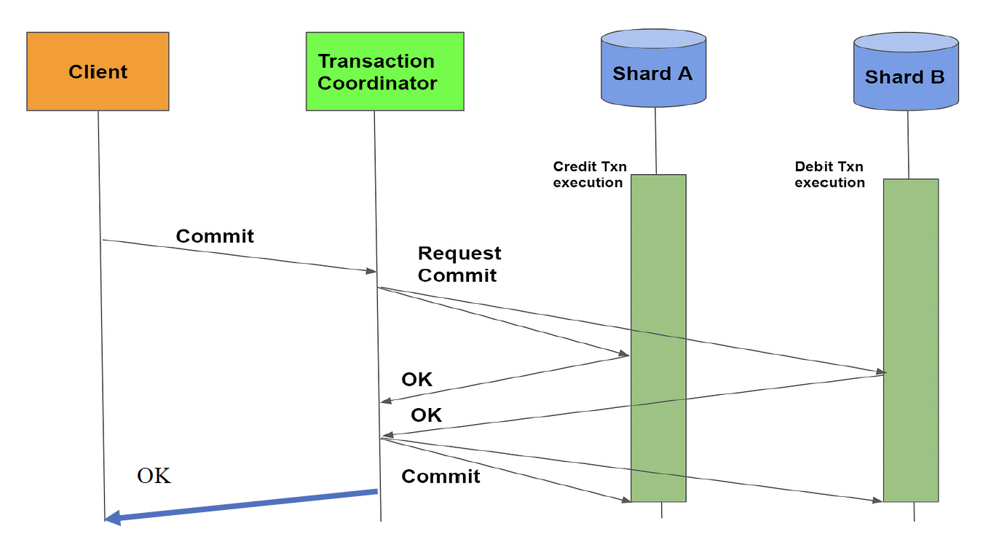

# Trabalho Prático | Computação Distribuída

## Objetivo

- Implementar os códigos para o processamento de transações em crédito e débito aos seguintes componentes do sistema de transação bancária:

    - Client
    - Transaction Coordinator
    - ShardA
    - ShardB

## Estratégia de Implementação

1. Escreva o código a ser executado por cada componente utilizando a política First In First Out (FIFO).

    - [Código | Cliente](./Docker/Client/cliente.py)
    - [Código | Coordenador da Transação](./Docker/CoordTrans/coord.py)
    - [Código | ShardA](./Docker/ShardA/shardA.py)
    - [Código | ShardB](./Docker/ShardB/shardB.py)

### Docker

2. Para implementação do sistema em questão, serão criados um container para cada componente pela plataforma Docker.

    - [Dockerfile | Cliente](./Docker/Client/Dockerfile)
    - [Dockerfile | Coordenador da Transação](./Docker/CoordTrans/Dockerfile)
    - [Dockerfile | ShardA](./Docker/ShardA/Dockerfile)
    - [Dockerfile | ShardB](./Docker/ShardB/Dockerfile)

3. Em seguida, foi criado um arquivo docker compose em .yaml para subir os serviços de forma modularizada.

    - [Docker Compose](./Docker/docker-compose.yaml)

4. Para realizar os testes, utilizou os seguintes comandos:

    Para subir os componentes e construir a imagem:

        docker compose up --build

    Para descer os componentes e apagar os mesmos:

        docker compose down

### Melhorias

As melhorias que poderiam ser implementadas são:

- Adicionar o input ao usuário de modo interativo
- Realizar a devida atualização do saldo para o cliente
- Adaptar o código para ser acessado via página Web

## Alunos

- [Isabelle Bicudo](https://github.com/IsabelleBic20)
- [Kelvisck Cabral](https://github.com/Kelvisck)
- [Kaê Budke](https://github.com/budkee)